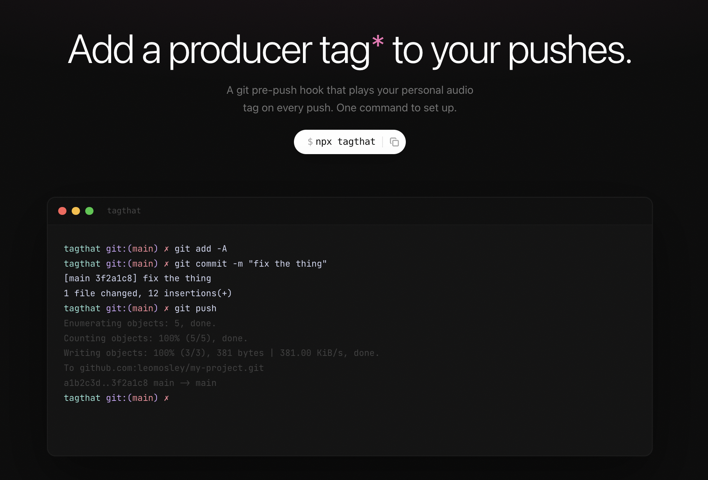

# tagthat



```sh
npx tagthat
```

## Commands

| Command               | Description                            |
| --------------------- | -------------------------------------- |
| `tagthat`             | Set up tagthat in the current git repo |
| `tagthat add <name>`  | Add a contributor slot                 |
| `tagthat test [name]` | Simulate a push and play your tag      |

## How it works

`tagthat` installs a git pre-push hook that plays a random audio file from `.tagthat/<your-name>/` every time you push. Drop any `.mp3` or `.wav` into that folder and it plays on push.

## License

MIT
